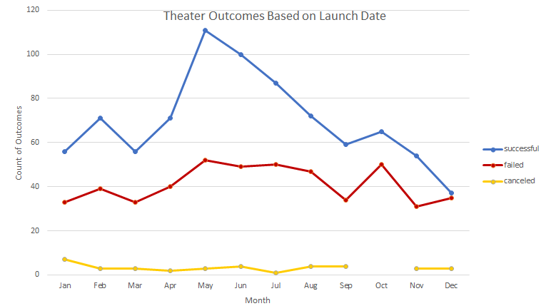
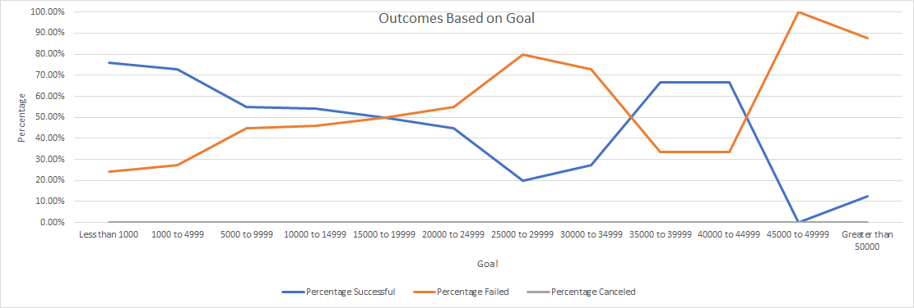

# Kickstarting with Excel

## Overview of Project

### Purpose

The purpose of this analysis is to provide insight into characteristics that indicate greater chances of success when launching a Kickstarter campaign for a theatrical play, based upon the choice of launch month theatrical productions as well as upon target fundraising goal ranges for plays specifically. To accomplish these objectives, key information from a Kickstarter database was utilized to develop a pivot chart summarizing the number of successful, failed, and canceled campaigns for theatrical projects per the month the campaigns were created. In addition, a line graph was developed to present Kickstarter outcomes (e.g., successful, failed, canceled) stratified by the range of campaign goals (presented in dollars).

## Analysis and Challenges

### Analysis of Outcomes Based on Launch Date

In a previous lesson, we converted times each Kickstarter campaign was launched, presented in UNIX time, to human date codes using the following formula in a new column:

`=(((CELL/60)/60)/24)+DATE(1970,1,1)`

In the current challenge, we converted that human date to only present the year the Kickstarter campaign was created using the following formula in a new column:

`=YEAR(CELL)`

In a new sheet, a pivot table was developed from the Kickstarter! worksheet where “Parent Category” and “Years” were utilized as filters. The independent variables, in this case the months of the year, were placed in the Axis (categories) of the pivot table fields, with the yearly and quarterly options removed leaving only the months remaining. The dependent variables populated in the columns for the Legend (series) portion of the pivot table fields were the outcomes. The Σ Values of interest populated in the pivot table fields were the counts of outcomes. 

The Parent Category filter was utilized to only present information on Kickstarter campaigns categorized as “Theater”. Though the ability to filter by year was included, we did not restrict the analysis by year and included all years for the primary analysis. A Pivot chart was created from this information to present theater outcomes based on the month of launch:

### Analysis of Outcomes Based on Goals

Per the instructions in the Module Challenge, a new sheet was created that included a new table to present data on successful, failed, and canceled Kickstarter play campaigns stratified by ranges of campaign goals. For each outcome, we used the COUNTIFS function to present the count of Kickstarter play campaigns that qualified based upon their target fundraising goal. As an example, the equation used to identify Kickstarter play campaigns that were successfully funded and had a target fundraising goal of $5,000-$9,999 was as follows:

`=COUNTIFS(Kickstarter!$F:$F,"successful", Kickstarter!$D:$D,">=5000", Kickstarter!$D:$D,"<=9999", Kickstarter!$R:$R, "plays")`

Counts for total projects for each fundraising goal strata were summed from the counts of the number successful, number failed, and number canceled (though there were zero canceled Kickstarter play campaigns in the dataset) using the following equation for the "less than 1000" row:

`=SUM(B2:D2)`

Percentages for each outcome were calculated by dividing the counts of each respective outcome by the total projects per goal strata using the following equation to find the percentage of successful Kickstarter play campaigns when the goal was 10000-14999:

`=B5/$E5`

From the finished table, a line chart was created that presented information on the percentage of Kickstarter play campaigns by outcome, stratified by target fundraising goal, as seen below:

### Challenges and Difficulties Encountered

One key personal challenge in populating pivot charts is keeping straight which variables are populated into rows and which into columns. To help determine the best presentation of data, I have worked to recall that the independent variable should almost always be placed in the row section, and the dependent variables populate the columns. In the current analysis and most simple analyses, the counts of the dependent variable(s) should populate the Σ Values portion of the pivot table fields.

For the use of the COUNTIFS equation, it was important to keep in mind that the greater than and less than signs are not inclusive, unless you also add the equal sign. For a dataset where many values will be round values right at the edge of a strata, you risk missing key datapoints if you forget to account for this requirement. When writing up findings, I had to revise my equations to ensure that the "x999" values were inclusive, leading to a small change in my data that I would have otherwise not included in the table.

## Results

- From the analysis of theater outcomes by launch date, we can tell that: 
1) Historically, May has been the optimal month to launch a Kickstarter theater campaign, with diminishing benefit through June, July, and August. The least viable months to initiate a Kickstarter theater campaign are November, December, January, and March. When limiting the analysis to the most recent three years of data (2015-2017) we find that May remains the optimal month to launch  Kickstarter theater campaign. Interestingly, the month of February has emerged in the past three years as a reasonable option for launch date as well. Ultimately the data from this set indicates that May is the optimal month to launch a Kickstarter theater campaign.
2) The rate of failed campaigns trends consistent, but at a lower rate, than successful campaigns for most months, with the greatest gap between success and failure in May and June. The gap between success and failure is smallest in December. December also has the lowest number of successful campaigns of all months. Based on the data in this set, it would be a poor decision to launch a Kickstarter theater campaign in December.

- From the analysis of outcomes based on stratified fundraising goals, we see that lower target fundraising goals have led to a greater number of successful campaigns when compared to failed campaigns. In general, the higher the campaign fundraising goal, the fewer total projects were identified in the dataset. There was also generally a higher risk of failure with higher fundraising goals. Though campaigns ranging between 35000-44999 had a 66.67% success rate, there were only 9 total campaigns in this range, and conclusions should not be drawn on such a small set of data compared to the 1047 overall count of all Kickstarter play campaigns in the dataset.

- Limitations of this dataset include an inconsistent level of granularity in the parent categories and subcategories. This can lead to irregular grouping of campaigns that could obscure data trends that would track with specific genres of projects. In addition, the dataset does not separate out for-profit and not-for-profit campaigns, which we could expect to have different fundraising characteristics. Finally, Kickstarter is the most prominent online fundraising platform but it is certainly not the sole such website. If we wanted to draw broader conclusions on developing a successful fundraising campaign, we would want to investigate data from additional fundraising platforms and websites.

- Additional information that could be useful in the development of a successful Kickstarter fundraising campaign would include information about the successful campaigns that far exceeded their fundraising targets. A pivot table and chart could be created that identifies campaigns that raised 150% or more of their target to review the characteristics of these very successful campaigns. In addition, because we have data on the start and end dates for campaigns, we could create a new table and chart that tracks the percentage of funds raised per time period (e.g., per day or per month) for successful, failed, and canceled campaigns to get a better sense for trends in fundraising over the length of a campaign, as well as to identify the optimal length for a campaign.
